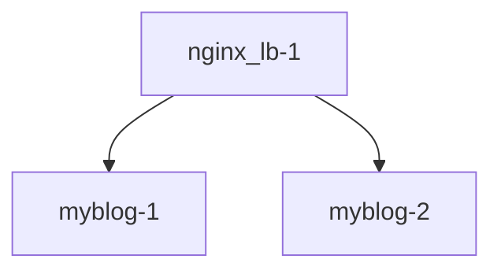

## 서비스 디스커버리 NGINX 버전 nginx -> (httpd, httpd)

# Dockerfile

## 구조


## 첫번째 도커로 수동으로 LB GATEWAY 구성
```
$ docker build -t a2blog:251014.1 docker_file/httpd/
$ docker run -dit --name myblog-1 -p 8051:80 a2blog:251014.1
$ docker run -dit --name myblog-2 -p 8052:80 a2blog:251014.1

$ docker build -t nginx_lb:251014.2 docker_file/nginx/ # https://docs.docker.com/engine/reference/commandline/run/#options
$ docker run --name nginx_lb-1 -d -p 9051:80 --link myblog-1 --link myblog-2 nginx_lb:251014.1
```

# docker compose

# Docker network 활용

(issue #55 참고)

### lb, myblog-1, mylbog-2를 하나의 네트워크로 연결

- 컨테이너 생성(기존에 같은 이름의 컨테이너가 있다면 삭제)

```bash
$ sudo docker run -dit --name myblog-1 -p 8051:80 a2blog:251014.1
$ sudo docker run -dit --name myblog-2 -p 8052:80 a2blog:251014.1
$ sudo docker run --name nginx_lb-1 -d -p 9051:80 nginx_lb:251014.2
```

- 네트워크 생성

```bash
$ sudo docker network create blog-net
```

- blog-net에 컨테이너 연결(만약에 nginx_lb-1 죽어있으면 start 해보기)

```bash
$ sudo docker network connect blog-net myblog-1
$ sudo docker network connect blog-net myblog-2
$ sudo docker network connect blog-net nginx_lb-1
```

- `default.conf` 파일에 upstream 정의되어 있어야함

```bash
$ cat docker_file/nginx/default.conf
upstream blog_servs {
        server **myblog-1**:80;
        server **myblog-2**:80;
}

server {
        listen 80;
        location / {
                proxy_pass http://blog_servs;
        }
}
```

### [localhost:9051](http://localhost:9051) 접속하고 새로고침하면 myblog들의 로그를 확인해보면

myblog-1, myblog-2 번갈아가면서 로드 밸런싱 잘 되어 있음 !!

```bash
$ sudo docker logs -f myblog-1
...
============================================================
172.20.0.4 - - [14/Oct/2025:07:27:11 +0000] "GET / HTTP/1.0" 304 -
172.20.0.4 - - [14/Oct/2025:07:27:11 +0000] "GET / HTTP/1.0" 304 -
172.20.0.4 - - [14/Oct/2025:07:27:12 +0000] "GET / HTTP/1.0" 304 -
172.20.0.4 - - [14/Oct/2025:07:27:13 +0000] "GET / HTTP/1.0" 304 -

$ sudo docker logs -f myblog-2
...
============================================================
172.20.0.4 - - [14/Oct/2025:07:27:11 +0000] "GET / HTTP/1.0" 304 -
172.20.0.4 - - [14/Oct/2025:07:27:11 +0000] "GET / HTTP/1.0" 304 -
172.20.0.4 - - [14/Oct/2025:07:27:12 +0000] "GET / HTTP/1.0" 304 -
172.20.0.4 - - [14/Oct/2025:07:27:13 +0000] "GET / HTTP/1.0" 304 -
```

