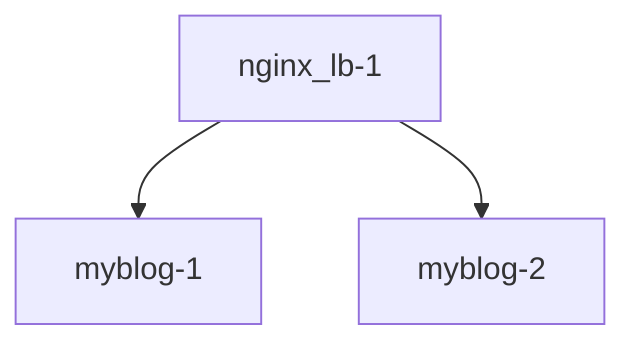

## 서비스 디스커버리 NGINX 버전 nginx -> (httpd, httpd)

# Dockerfile

## 구조


## 첫번째 도커로 수동으로 LB GATEWAY 구성
```
$ docker build -t a2blog:251014.1 docker_file/httpd/
$ docker run -dit --name myblog-1 -p 8051:80 a2blog:251014.1
$ docker run -dit --name myblog-2 -p 8052:80 a2blog:251014.1

$ docker build -t nginx_lb:251014.2 docker_file/nginx/ # https://docs.docker.com/engine/reference/commandline/run/#options
$ docker run --name nginx_lb-1 -d -p 9051:80 --link myblog-1 --link myblog-2 nginx_lb:251014.1
```

# docker compose

